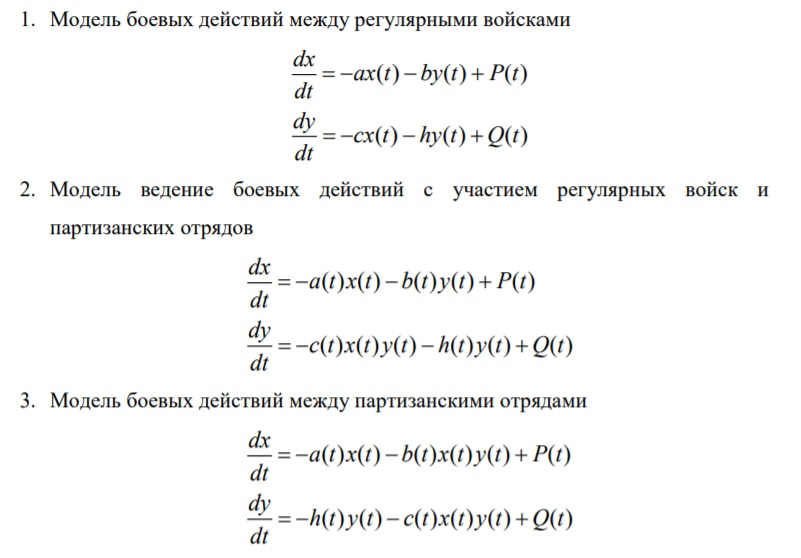

---
## Front matter
lang: ru-RU
title: Structural approach to the deep learning method
author: |
	Kuchenov I.V\inst{1,3}

## Formatting
toc: false
slide_level: 2
theme: metropolis
header-includes:
 - \metroset{progressbar=frametitle,sectionpage=progressbar,numbering=fraction}
 - '\makeatletter'
 - '\beamer@ignorenonframefalse'
 - '\makeatother'
aspectratio: 43
section-titles: true
---

# Модель боевых действий

## Постановка задачи

Между страной Х и страной У идет война. Численность состава войск
исчисляется от начала войны, и являются временными функциями
x(t) и y(t). В начальный момент времени страна Х имеет армию численностью 120 000 человек, а в распоряжении страны У армия численностью в 90 000 человек. Для упрощения модели считаем, что коэффициенты a b c h постоянны. Также считаем P(t) и Q(t) непрерывные функции.

## Цель

Цель - Проверить, как работает модель в различных ситуациях.

### Теоретическая часть:

### 1. { #fig:001 width=70% }

## Ход решения

### 1. { #fig:001 width=70% }

### 2. { #fig:001 width=70% }

### 3. { #fig:001 width=70% }
