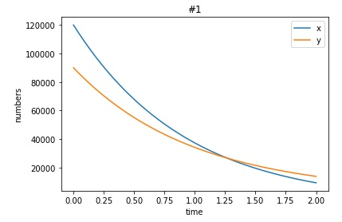

---
# Front matter
lang: ru-RU
title: "Отчёт лабораторной работы №3"
subtitle: ""
author: "Кученов Ирзилей Сайын Вячеславович, преподаватель: Кулябов Дмитрий Сергеевич"

# Formatting
toc-title: "Содержание"
toc: true # Table of contents
toc_depth: 2
lof: true # List of figures
lot: true # List of tables
fontsize: 12pt
linestretch: 1.5
papersize: a4paper
documentclass: scrreprt
polyglossia-lang: russian
polyglossia-otherlangs: english
mainfont: PT Serif
romanfont: PT Serif
sansfont: PT Sans
monofont: PT Mono
mainfontoptions: Ligatures=TeX
romanfontoptions: Ligatures=TeX
sansfontoptions: Ligatures=TeX,Scale=MatchLowercase
monofontoptions: Scale=MatchLowercase
indent: true
pdf-engine: lualatex
header-includes:
  - \linepenalty=10 # the penalty added to the badness of each line within a paragraph (no associated penalty node) Increasing the value makes tex try to have fewer lines in the paragraph.
  - \interlinepenalty=0 # value of the penalty (node) added after each line of a paragraph.
  - \hyphenpenalty=50 # the penalty for line breaking at an automatically inserted hyphen
  - \exhyphenpenalty=50 # the penalty for line breaking at an explicit hyphen
  - \binoppenalty=700 # the penalty for breaking a line at a binary operator
  - \relpenalty=500 # the penalty for breaking a line at a relation
  - \clubpenalty=150 # extra penalty for breaking after first line of a paragraph
  - \widowpenalty=150 # extra penalty for breaking before last line of a paragraph
  - \displaywidowpenalty=50 # extra penalty for breaking before last line before a display math
  - \brokenpenalty=100 # extra penalty for page breaking after a hyphenated line
  - \predisplaypenalty=10000 # penalty for breaking before a display
  - \postdisplaypenalty=0 # penalty for breaking after a display
  - \floatingpenalty = 20000 # penalty for splitting an insertion (can only be split footnote in standard LaTeX)
  - \raggedbottom # or \flushbottom
  - \usepackage{float} # keep figures where there are in the text
  - \floatplacement{figure}{H} # keep figures where there are in the text
---

# Цель работы

Цель - Проверить, как работает модель в различных ситуациях.

# Задание

Построить графики изменения численности войск армии Х и армии У.

# Выполнение лабораторной работы

1. Постановка задачи

Между страной Х и страной У идет война. Численность состава войск
исчисляется от начала войны, и являются временными функциями
x(t) и y(t). В начальный момент времени страна Х имеет армию численностью 120 000 человек, а в распоряжении страны У армия численностью в 90 000 человек. Для упрощения модели считаем, что коэффициенты a b c h постоянны. Также считаем P(t) и Q(t) непрерывные функции.

2. Построение графиков

Для построения графиков используется питон.

Мои значения:
{ #fig:001 width=70% }

Код:
{ #fig:001 width=70% }

Построение графиков:
Графики:

Первый случай:
{ #fig:001 width=70% }

Второй случай:
{ #fig:001 width=70% }

# Выводы
Результат: Построили графики и увидели различия при разных коэфицентах.

Вывод: Построили математическую модель, использовали python, выявили результаты для обоих случаев, научились строить математическую модель для нахождения исхода и результатов.
